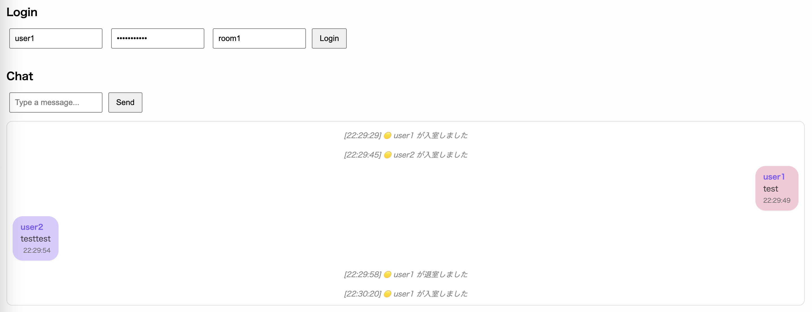

## web-socketを使ったチャットアプリ
web-socketを使ったことがなかったので、練習として簡単なアプリを作成

### 機能

- ユーザー名とパスワードでログイン（JWT認証）
- WebSocketでリアルタイムなチャット通信
- ルーム機能（同じルームに入ったユーザー同士だけが会話できる）
- メッセージの送信時刻を表示
- 入室／退室時の通知メッセージ
- SQLiteでチャット履歴を保存・読み込み（ルームごとに復元される）

### 使用技術

- **Go**：サーバーサイド（WebSocket処理 + JWT認証）
- **Gorilla WebSocket**：WebSocketライブラリ
- **JWT（JSON Web Token）**：ユーザー認証トークン発行
- **HTML/JavaScript**：フロントエンド

